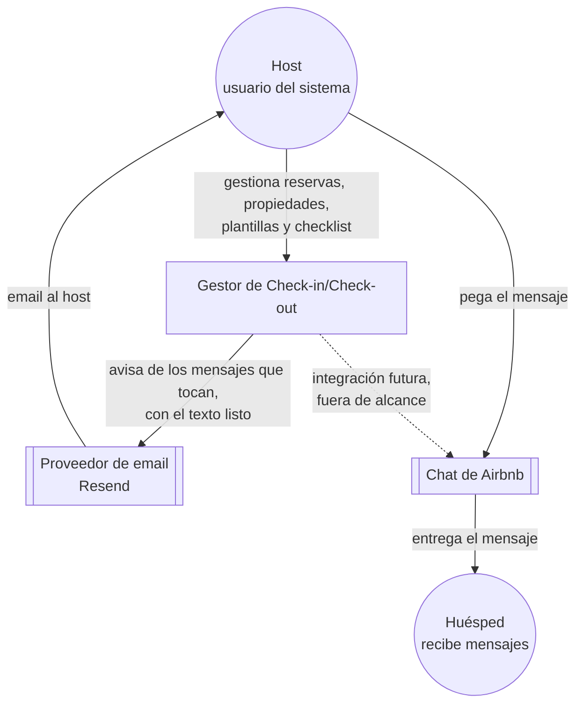
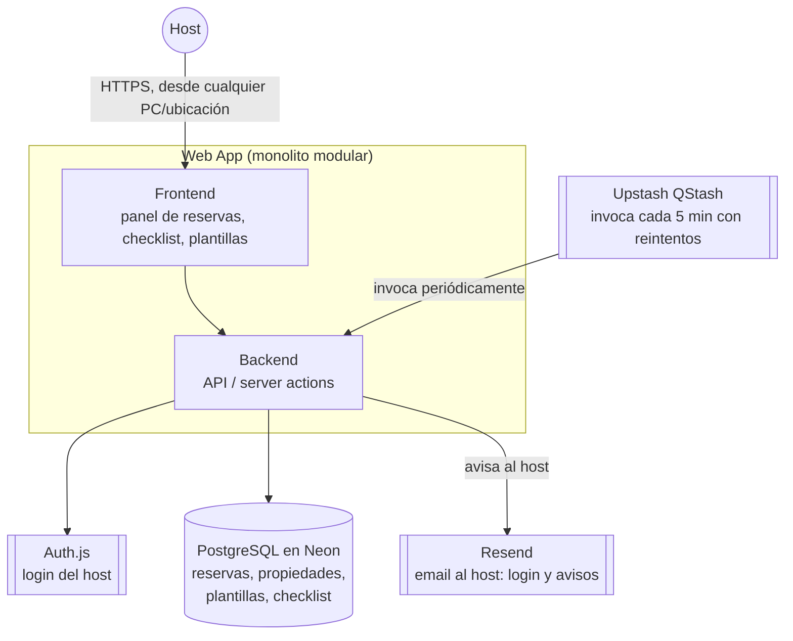
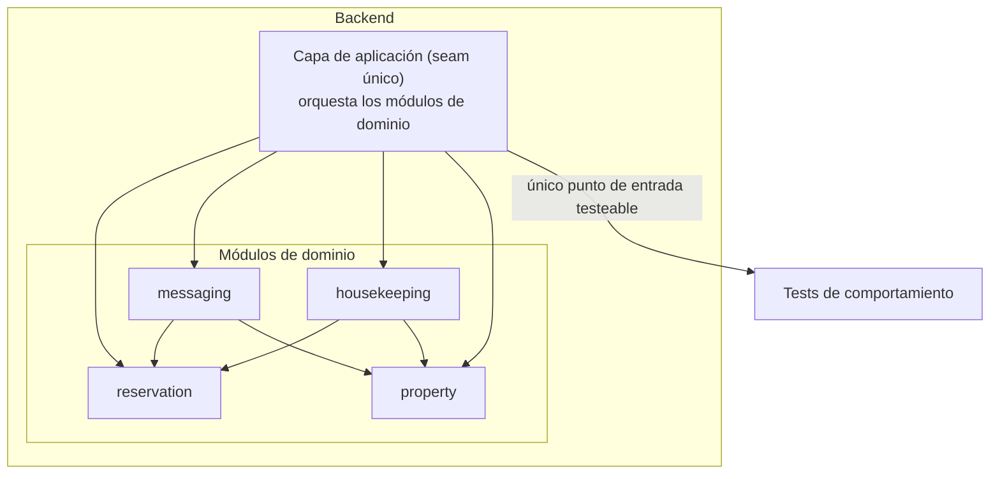

# Arquitectura — Gestor de Check-in/Check-out

Basado en `SPEC.md`. Proyecto greenfield, un solo host operando (single-tenant en la práctica), volumen bajo (decenas de reservas, no miles). La arquitectura prioriza velocidad de entrega y bajo coste operativo por encima de escalabilidad prematura — ver ADR-001.

## C4 — Nivel 1: Contexto



## C4 — Nivel 2: Contenedores



Los mensajes al huésped no salen del sistema: el host los pega en el chat de Airbnb (ADR-006).

Un único desplegable. Nada de microservicios ni colas propias: con un host y reservas de bajo volumen, el coste de coordinación distribuida no se justifica (ADR-001). La base de datos y el disparo de tareas son servicios gestionados externos (Neon, QStash) — no infraestructura que haya que operar (ver ADR-004 y ADR-005), y accesibles desde cualquier ubicación sin configuración adicional.

## C4 — Nivel 3: Componentes (dentro de WebApp)



Esto es lo que `SPEC.md` dejaba pendiente como "seam de testing": la capa de aplicación (`UseCases`) es el único seam. Los tests ejercitan `reservation → dispara housekeeping → dispara messaging` a través de esa capa, sin tocar UI ni infraestructura (DB, proveedor de notificaciones se mockean ahí).

## Módulos de dominio y responsabilidades

| Módulo | Responsabilidad | Depende de |
|---|---|---|
| `property` | Datos maestros de cada piso (dirección, wifi, accesos) | — |
| `reservation` | Ciclo de vida de una reserva y sus estados | `property` |
| `housekeeping` | Checklist de preparación por propiedad, estado por reserva | `property`, `reservation` |
| `messaging` | Plantillas, variables, programación y envío | `property`, `reservation` |

## Estructura de carpetas propuesta

```
src/
  domain/
    reservation/
    messaging/
    housekeeping/
    property/
  application/        # casos de uso, el seam único
  infrastructure/      # DB (Drizzle), proveedor de notificaciones, cron
  ui/                   # panel del host
```

Monolito modular: los límites son de código (carpetas + interfaces), no de red. Si en el futuro un módulo necesita escalar por separado, se extrae porque el límite ya existe — no se paga ese coste ahora.

## Decisiones formalizadas

Ver `docs/adr/`:
- [ADR-001](docs/adr/0001-monolito-modular.md) — Monolito modular vs. microservicios
- [ADR-002](docs/adr/0002-nextjs-fullstack.md) — Next.js full-stack vs. backend + frontend separados
- [ADR-003](docs/adr/0003-postgresql.md) — PostgreSQL vs. NoSQL
- [ADR-004](docs/adr/0004-disparo-mensajes-cron.md) — Upstash QStash vs. alternativas de cron para disparos programados
- [ADR-005](docs/adr/0005-proveedor-hosting-datos.md) — Neon+Auth.js vs. Supabase vs. PocketBase autoalojado
- [ADR-006](docs/adr/0006-canal-de-mensajes.md) — Copiar y pegar en Airbnb vs. email directo al huésped

## Riesgos y límites conocidos

- **Escaneo periódico vía QStash** (ADR-004): si el volumen crece mucho (muchos hosts, no solo uno), un scan cada 5 min deja de ser trivial y/o se supera el free tier de 1.000 mensajes/día. Ceiling: cientos de reservas activas simultáneas. Upgrade: cola con jobs programados individualmente.
- **Single-tenant de facto**: el modelo de datos no impide multi-host, pero no hay aislamiento ni permisos entre hosts en el MVP. Si el producto se abre a más hosts, hace falta revisar auth/autorización antes.
- **Dependencia de proveedores externos gestionados** (Neon, QStash, Resend): a cambio de no operar infraestructura propia, la disponibilidad del sistema depende de la de ellos. Se eligieron en septiembre de 2026 en base a su estado verificado en ese momento (ver ADR-005) — revisar si alguno mostrara un patrón de incidentes similar al detectado en Supabase.
